* Student name: Tamjid Ahsan
* Student pace: Full Time
* Scheduled project review date/time: May 27, 2021, 05:00 PM [DST]
* Instructor name: James Irving
* Blog post URL: TBA

# INTRODUCTION

The garment industry one of the highly labor-intensive industries that needs large number of human resources to efficient and keep up with demand for garment products across the globe. Because of this inherent dependency on human capital, the production of a garment company comprehensively relies on the productivity of the employees in different departments. Often actual productivity of the garment employees is not in line with targeted productivity that was set. This is a high priority for a organization to achieve deadline and maximize profit by ensuring proper utilization of resources. When any productivity gap occurs, the company faces a huge loss in production.<br>


# BUSINESS PROBLEM

A garment production pipeline consists of a handful of sequential processes, e.g., designing, sample confirmation, sourcing and merchandising, lay planning, marker planning, spreading and cutting, sewing, washing, finishing, and packaging, and then exporting if the order is a international one. An efficient garment production always consists of a line plan with explicit details of when the production will be started, how many pieces are expected, and when the order needs to be completed. To complete a whole production within a target time, these sequential processes need to be to performed efficiently. In order to meet the production goals, the associated industrial engineers strategically set a targeted productivity value against each working team in the manufacturing process. However, it is a common scenario that the actual productivity does not align with the target for several factors, both internal and external.


<br>
I shall use various machine learning techniques for predicting the productivity of the garment employees based on their previous data of internal factors.

<br> More specifically:
- Predict bad performance of workers. Optimize model for precision.
    - Focus on predicting bad performance, don't want to miss much of those. 
    - Focus on maximizing true negatives and minimizing false positives while tackling model overfitting.
    
<br>


# OBTAIN

The data is obtained from <i>UCI Machine Learning Repository</i>, titled <b>"Productivity Prediction of Garment Employees Data Set"</b> by [Abdullah Al Imran](abdalimran@gmail.com)<sup>[1]</sup>. Which can be found [here](https://archive.ics.uci.edu/ml/datasets/Productivity+Prediction+of+Garment+Employees#). A copy of the data is in this repository at `/data/garments_worker_productivity.csv`.

The collected dataset contains the production data of the sewing and finishing department for three months from January 2015 to March 2015 of a renowned garment manufacturing company in Bangladesh<sup>[2]</sup>. The dataset consists of 1197 instances and includes 13 attributes.


<br>
Features with explanation.

 - `date`: Date in MM-DD-YYYY format.
 - `day`: Day of the Week.
 - `quarter`: A portion of the month. A month was divided into four quarters.
 - `department`: Associated department with the instance.
 - `team_no`: Associated team number with the instance.
 - `no_of_workers`: Number of workers in each team.
 - `no_of_style_change`: Number of changes in the style of a particular product.
 - `targeted_productivity`: Targeted productivity set by the Authority for each team for each day.
 - `smv`: Standard Minute Value, it is the allocated time for a task.
 - `wip`: Work in progress. Includes the number of unfinished items for products.
 - `over_time`: Represents the amount of overtime by each team in minutes.
 - `incentive`: Represents the amount of financial incentive (in BDT<sup>[3]</sup>) that enables or motivates a particular course of action.
 - `idle_time`: The amount of time when the production was interrupted due to several reasons.
 - `idle_men`: The number of workers who were idle due to production interruption.
 - `actual_productivity`: The actual % of productivity that was delivered by the workers. It ranges from 0-1<sup>[4]</sup>.


<br>


___
[1]  ```Rahim, M. S., Imran, A. A., & Ahmed, T. (2021). Mining the Productivity Data of Garment Industry. International Journal of Business Intelligence and Data Mining, 1(1), 1. ```
<br>[2] Bangladesh is a developing country which is the second largest apparel exporting country in the world.
<br>[3] 1 USD = 84.83 BDT, as of May 23,2021. Check [here](https://www.bb.org.bd/en/index.php/econdata/exchangerate) from Bangladesh Bank.
<br>[4] Measured by production production engineers of the organization. Methodology of this calculation is not public.


<br>
<div>Reference:
<p class="normal">@article{Rahim_2021,
<br>	doi = {10.1504/ijbidm.2021.10028084},
<br>	url = {<a href="https://doi.org/10.1504%2Fijbidm.2021.10028084">[Web Link]</a>},
<br>	year = 2021,
<br>	publisher = {Inderscience Publishers},
<br>	volume = {1},
<br>	number = {1},
<br>	pages = {1},
<br>	author = {Md Shamsur Rahim and Abdullah Al Imran and Tanvir Ahmed},
<br>	title = {Mining the Productivity Data of Garment Industry},
<br>	journal = {International Journal of Business Intelligence and Data Mining}
<br>}
</p></div>

# SCRUB & EXPLORE

## data


```python
# loading data from local source
df = pd.read_csv('./data/garments_worker_productivity.csv')
```


```python
# 10 sample of the dataset. Data loading successful.
df.sample(10)
```


<table border="1" class="dataframe">
  <thead>
    <tr style="text-align: right;">
      <th></th>
      <th>date</th>
      <th>quarter</th>
      <th>department</th>
      <th>day</th>
      <th>team</th>
      <th>targeted_productivity</th>
      <th>smv</th>
      <th>wip</th>
      <th>over_time</th>
      <th>incentive</th>
      <th>idle_time</th>
      <th>idle_men</th>
      <th>no_of_style_change</th>
      <th>no_of_workers</th>
      <th>actual_productivity</th>
    </tr>
  </thead>
  <tbody>
    <tr>
      <th>797</th>
      <td>2/16/2015</td>
      <td>Quarter3</td>
      <td>finishing</td>
      <td>Monday</td>
      <td>5</td>
      <td>0.75</td>
      <td>4.15</td>
      <td>NaN</td>
      <td>1200</td>
      <td>0</td>
      <td>0.0</td>
      <td>0</td>
      <td>0</td>
      <td>10.0</td>
      <td>0.629417</td>
    </tr>
    <tr>
      <th>693</th>
      <td>2/10/2015</td>
      <td>Quarter2</td>
      <td>finishing</td>
      <td>Tuesday</td>
      <td>2</td>
      <td>0.80</td>
      <td>3.94</td>
      <td>NaN</td>
      <td>2160</td>
      <td>0</td>
      <td>0.0</td>
      <td>0</td>
      <td>0</td>
      <td>18.0</td>
      <td>0.966759</td>
    </tr>
    <tr>
      <th>530</th>
      <td>1/31/2015</td>
      <td>Quarter5</td>
      <td>finishing</td>
      <td>Saturday</td>
      <td>11</td>
      <td>0.65</td>
      <td>3.94</td>
      <td>NaN</td>
      <td>600</td>
      <td>0</td>
      <td>0.0</td>
      <td>0</td>
      <td>0</td>
      <td>5.0</td>
      <td>0.971867</td>
    </tr>
    <tr>
      <th>325</th>
      <td>1/19/2015</td>
      <td>Quarter3</td>
      <td>sweing</td>
      <td>Monday</td>
      <td>2</td>
      <td>0.70</td>
      <td>22.94</td>
      <td>1006.0</td>
      <td>10170</td>
      <td>38</td>
      <td>0.0</td>
      <td>0</td>
      <td>0</td>
      <td>56.5</td>
      <td>0.750518</td>
    </tr>
    <tr>
      <th>1055</th>
      <td>3/4/2015</td>
      <td>Quarter1</td>
      <td>sweing</td>
      <td>Wednesday</td>
      <td>3</td>
      <td>0.80</td>
      <td>29.40</td>
      <td>1169.0</td>
      <td>6840</td>
      <td>63</td>
      <td>0.0</td>
      <td>0</td>
      <td>0</td>
      <td>57.0</td>
      <td>0.800333</td>
    </tr>
    <tr>
      <th>1036</th>
      <td>3/3/2015</td>
      <td>Quarter1</td>
      <td>finishing</td>
      <td>Tuesday</td>
      <td>8</td>
      <td>0.75</td>
      <td>4.60</td>
      <td>NaN</td>
      <td>3360</td>
      <td>0</td>
      <td>0.0</td>
      <td>0</td>
      <td>0</td>
      <td>8.0</td>
      <td>0.702778</td>
    </tr>
    <tr>
      <th>890</th>
      <td>2/23/2015</td>
      <td>Quarter4</td>
      <td>sweing</td>
      <td>Monday</td>
      <td>5</td>
      <td>0.80</td>
      <td>30.10</td>
      <td>541.0</td>
      <td>7140</td>
      <td>38</td>
      <td>0.0</td>
      <td>0</td>
      <td>0</td>
      <td>59.0</td>
      <td>0.800137</td>
    </tr>
    <tr>
      <th>470</th>
      <td>1/27/2015</td>
      <td>Quarter4</td>
      <td>sweing</td>
      <td>Tuesday</td>
      <td>9</td>
      <td>0.70</td>
      <td>29.12</td>
      <td>1294.0</td>
      <td>6960</td>
      <td>50</td>
      <td>0.0</td>
      <td>0</td>
      <td>0</td>
      <td>58.0</td>
      <td>0.700386</td>
    </tr>
    <tr>
      <th>597</th>
      <td>2/3/2015</td>
      <td>Quarter1</td>
      <td>finishing</td>
      <td>Tuesday</td>
      <td>6</td>
      <td>0.70</td>
      <td>2.90</td>
      <td>NaN</td>
      <td>960</td>
      <td>0</td>
      <td>0.0</td>
      <td>0</td>
      <td>0</td>
      <td>8.0</td>
      <td>0.495417</td>
    </tr>
    <tr>
      <th>945</th>
      <td>2/26/2015</td>
      <td>Quarter4</td>
      <td>sweing</td>
      <td>Thursday</td>
      <td>7</td>
      <td>0.80</td>
      <td>30.10</td>
      <td>694.0</td>
      <td>4080</td>
      <td>50</td>
      <td>0.0</td>
      <td>0</td>
      <td>1</td>
      <td>59.0</td>
      <td>0.800809</td>
    </tr>
  </tbody>
</table>
</div>


Observation:
* every feature has correct data type except `team`.
* `team` is a categorical data which is labeled numerically.


* `wip` has NaN values. Those are not missing. For those days where there were no work in progress, data is empty. Those can be safely filled with 0.
* `smv` depends on product.
* `department` has issue with naming
* Value of 'Quarter5' in `quarter` is inconsistent with data description. Those data are for January 29, Thursday; and 31, Saturday of 2015. I can not come up with any rational for this treatment, Thus leaving it at is. Another option is to merge these with `Quarter4`.
every other feature is clean and coherent.
    
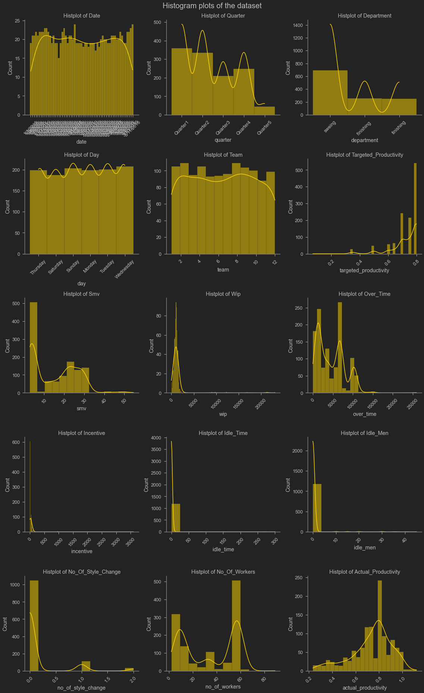
    


* None of them are normally distributed.
* Most of them are skewed. e.g., `idle_men`, `idle_time`, `incentive`, `wip`.
* `target` has few regular occurring values.
* `smv`, `overtime` has some very high values

## Feature engineering

### Creating target; `performance`

I am treating this as a binary classification model. For this I am converting `actual_productivity` into a binary class. Logic behind this operation is, if the `actual_productivity` is greater than `targeted_productivity` then its a 1, and 0 otherwise.
I am not encoding in text as most of the model requirs numerical data in target. This eliminates the need for label encoding. And for binary classification this does not create confusion while looking at reports of model performance. 

    1    0.730994
    0    0.269006
    Name: performance, dtype: float64


Straight away I can spot a class imbalance issue. I have to address this later while modeling.

### Cleaning `wip`
- filling NaN's with 0, meaning no wip for that session


### Text cleaning in `department` categories 


### Cleaning `quarter`
- as identified before, cleaning by merging Quarter5 with Quarter4


### Cleaning `targeted_productivity`


    targeted_productivity stats:
    ******************************
     0.8	 : mode
     0.73	 : mean
     0.7	 : 25% quantile
    ******************************
    


    
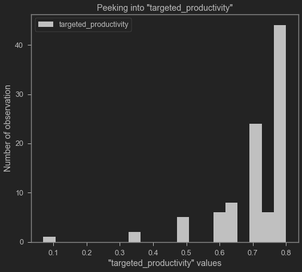
    


From this plot I can safely assume that this a data entry error. Setting a target so low does not make any sense. I am filling this with the 25% quantile .


No error remains.

### Drop features

Dropping `date` as this is not useful for modeling and timing is captured in `day` and `quarter` features, `actual_productivity` as this is the target in continuous format.


### EDA

#### which department has better performance


    
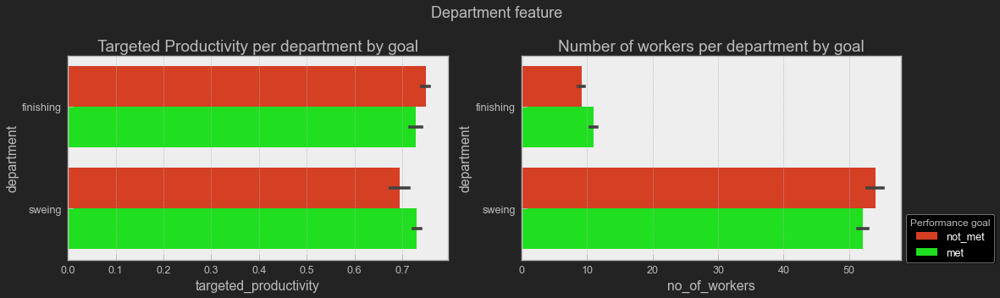
    


Finishing department and sewing department has similar targets and finishing department often fail to meet daily goal. This can be explained by the small size of finishing department. Adding a few workers can be beneficial.

#### productive day of the week


    
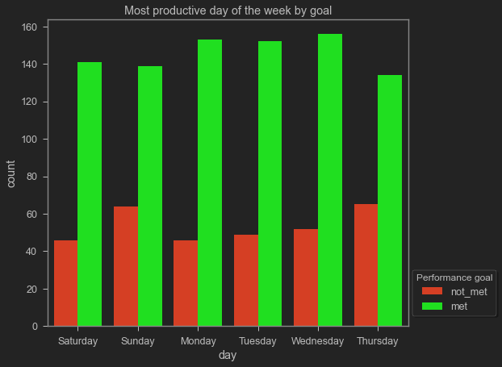
    


Overall same pattern with slight high level of goal not met on Sunday and Thursday.

#### exploring `team`

##### team size


    
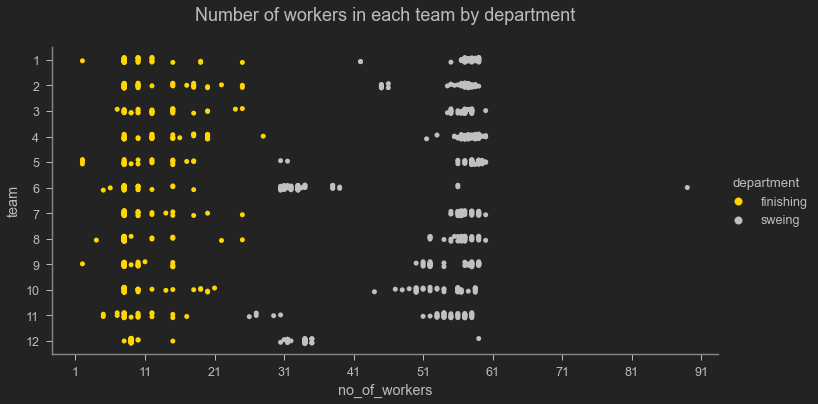
    


Generally finishing department worker size is low.

##### efficient team


    
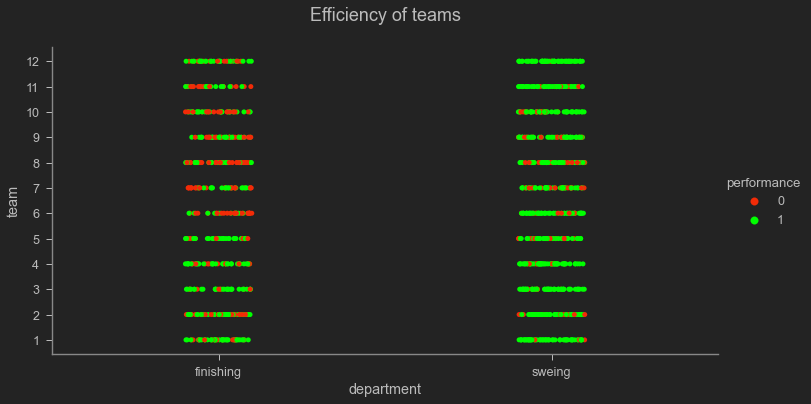
    


Finishing department fails to achieve goal more often. 

#### `smv` on `performance`

    
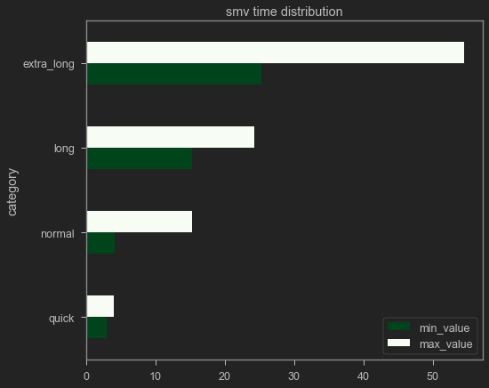
    


    
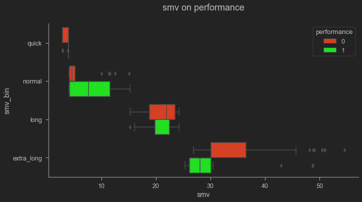
    


#### `wip` on `performance`
    
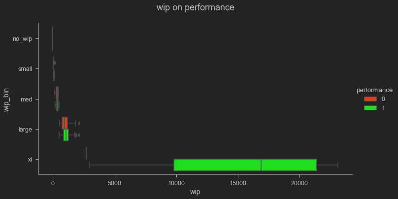
    


At higher wip there is less chance of failing.


    
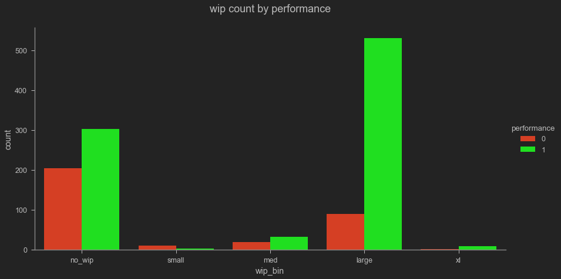
    


Same pattern, low wip does not necessarily mean a good workday. Some leftover work for the next day can mean that there is a greater chance of meeting that days goal.

#### `incentive` on `performance`


    
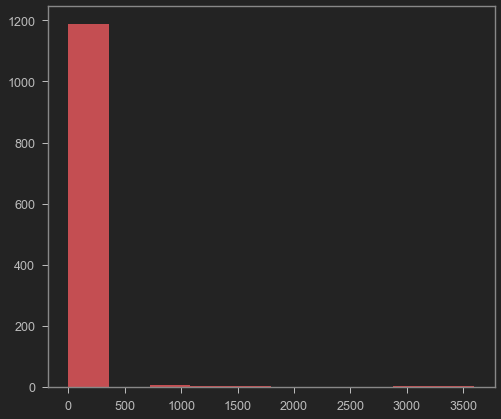
    


`incentive` distribution is highly skewed. lets slice by 500 BDT.


    
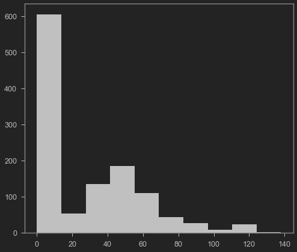
    


Most of the day there is no incentive payment.


    
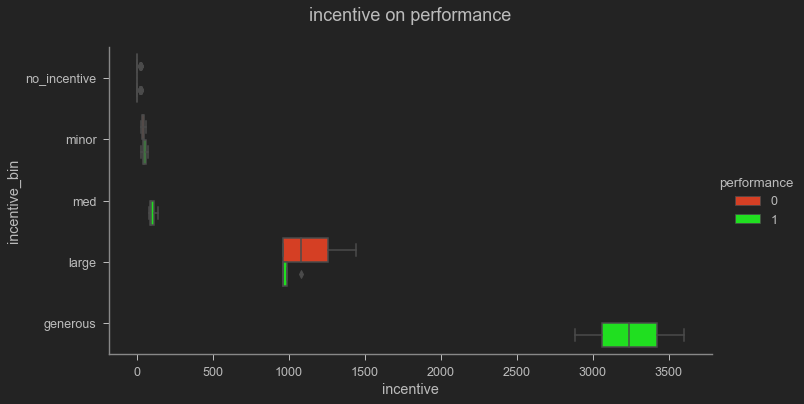
    


After binning it can be seen that at higher incentive the performance is better, as no goal unmet at generous incentive.

### preparing data for model


#### split using `sklearn`

I am using train-test split approach here. Other option is to use train-validation-test data split approach. As the data set is relatively small, the later approach makes my train data have fewer samples to train on. This is a real issue for model performance for some of the models used. They perform better with more train data.


```python
X = df.drop(columns='performance').copy()
y = df['performance'].copy()

X_train, X_test, y_train, y_test = train_test_split(X, y, test_size=.25)
```


    Class balance y_train: 
    1    0.729097
    0    0.270903
    Name: performance, dtype: float64
    
    Class balance y_test: 
    1    0.736667
    0    0.263333
    Name: performance, dtype: float64
    
    

Distribution of target class is somewhat consistent. Can be re-run for different distribution. But this is not necessary as I am tackling class imbalance issue with `SMOTENC`.

#### Addressing class imbalance using `SMOTENC`


```python
# keeping a class imbalanced dataset set for evaluation of preocess
X_imba, y_imba = X.copy(), y.copy()
# creating a copy just to be safe.
XX = X.copy()
yy = y.copy()
# first four features are categorical;
# in the original paper (Rahim, 2021) attached to this dataset also 
# considered `team` as categorical feature.
smotenc_features=[True]*4+[False]*9
# initialize SMOTENC
oversampling = SMOTENC(categorical_features=smotenc_features,n_jobs=-1)
# fiting
XX_oversampled, yy_oversampled = oversampling.fit_sample(XX,yy)
# updating dataset
X_train, y_train = XX_oversampled.copy(), yy_oversampled.copy()
```


#### Pipelining
I used pipeline from sklraen with a custom function to transform data. These are available in this repository. 


# MODEL

## dummy model


```python
# SMOTENC'ed, StandardScaled and OHE'ed data
X_train_dummy, X_test_dummy = fun.dataset_preprocessing_pipeline(
    X_train, X_test)

dummy_classifier = DummyClassifier(strategy='stratified')
```

    Class balance y_train: 
    1    0.5
    0    0.5
    Name: performance, dtype: float64
    
    Class balance y_test: 
    1    0.736667
    0    0.263333
    Name: performance, dtype: float64
    
    ------------------------------
    


<strong>Report of DummyClassifier type model using train-test split dataset.</strong>


    ******************************************************************************************
    Train accuracy score: 0.4931
    Test accuracy score: 0.5
        No over or underfitting detected, diffrence of scores did not cross 5% thresh hold.
    ******************************************************************************************
    
    ************************************************************
    Classification report on train data of:
            DummyClassifier(strategy='stratified')
    ------------------------------------------------------------
                  precision    recall  f1-score   support
    
               0       0.52      0.53      0.52       875
               1       0.52      0.52      0.52       875
    
        accuracy                           0.52      1750
       macro avg       0.52      0.52      0.52      1750
    weighted avg       0.52      0.52      0.52      1750
    
    ************************************************************
    


    
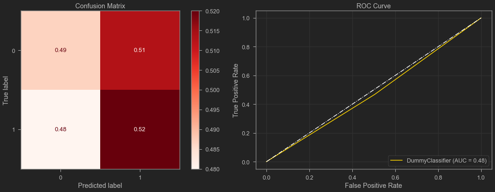
    


    ===============================================================================
    ************************************************************
    Classification report on test data of:
        DummyClassifier(strategy='stratified')
    ------------------------------------------------------------
                  precision    recall  f1-score   support
    
               0       0.28      0.48      0.36        79
               1       0.75      0.56      0.64       221
    
        accuracy                           0.54       300
       macro avg       0.52      0.52      0.50       300
    weighted avg       0.63      0.54      0.57       300
    
    ************************************************************
    


    
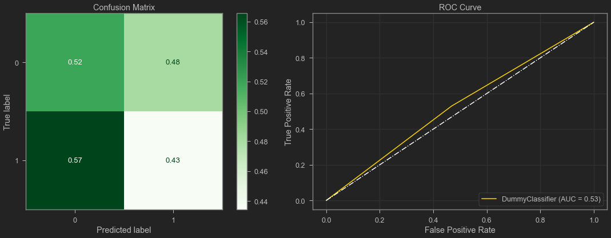
    


This is a worthless model. The f1 score is low, model accuracy is .5. This is not even better than flipping a coin to predict, which should be correct at random. 


## logistic regression

### filter with Pearson corr


    
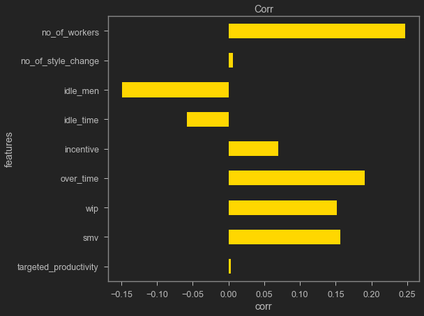
    


Most of them are correlated with the target except `no_of_style_change` and `targeted_productivity`.


    
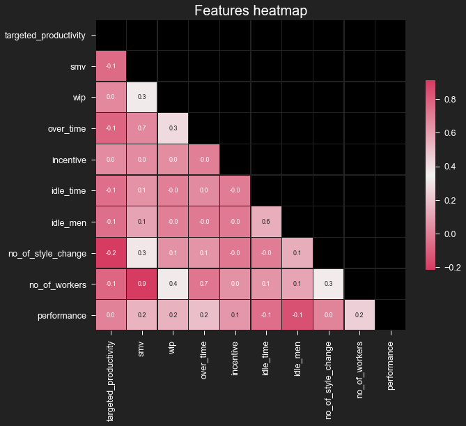
    


* No significant correlation is detected except `no_of_worker` and `smv`.
* `overtime` and `no_of_worker` is correlated.


```python
print(f"""Features should be dropped: {
                                    fun.drop_features_based_on_correlation(
                                    df, threshold=0.75)
                                        }""")
```


    Features should be dropped: {'no_of_workers'}
    


```python
# droping from train and test data
X_train_dropped_ = X_train.drop('no_of_workers',axis=1)
X_test_dropped_ = X_test.drop('no_of_workers',axis=1)
# SMOTENC'ed, StandardScaled, correlated feature dropped and OHE'ed data
X_train_log_reg, X_test_log_reg = fun.dataset_preprocessing_pipeline(
    X_train_dropped_, X_test_dropped_, drop='first')
```

### logistic regression classifier


```python
# logistic regression classifier
logreg = LogisticRegression(C=1e5, max_iter=1000, class_weight='balanced')
# score of logistic regression classifier
fun.model_report(logreg,
             X_train=X_train_log_reg,
             y_train=y_train,
             X_test=X_test_log_reg,
             y_test=y_test,show_train_report=True)
```


<strong>Report of LogisticRegression type model using train-test split dataset.</strong>


    ******************************************************************************************
    Train accuracy score: 0.7194
    Test accuracy score: 0.7367
        No over or underfitting detected, diffrence of scores did not cross 5% thresh hold.
    ******************************************************************************************
    
    ************************************************************
    Classification report on train data of:
            LogisticRegression(C=100000.0, class_weight='balanced', max_iter=1000)
    ------------------------------------------------------------
                  precision    recall  f1-score   support
    
               0       0.71      0.74      0.72       875
               1       0.73      0.70      0.71       875
    
        accuracy                           0.72      1750
       macro avg       0.72      0.72      0.72      1750
    weighted avg       0.72      0.72      0.72      1750
    
    ************************************************************
    


    
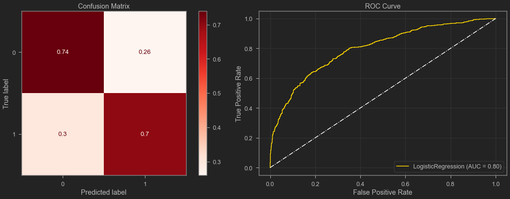
    


    ==========================================================================================================================================================================
    ************************************************************
    Classification report on test data of:
        LogisticRegression(C=100000.0, class_weight='balanced', max_iter=1000)
    ------------------------------------------------------------
                  precision    recall  f1-score   support
    
               0       0.52      0.79      0.63        84
               1       0.90      0.72      0.80       216
    
        accuracy                           0.74       300
       macro avg       0.71      0.75      0.71       300
    weighted avg       0.79      0.74      0.75       300
    
    ************************************************************
    


    
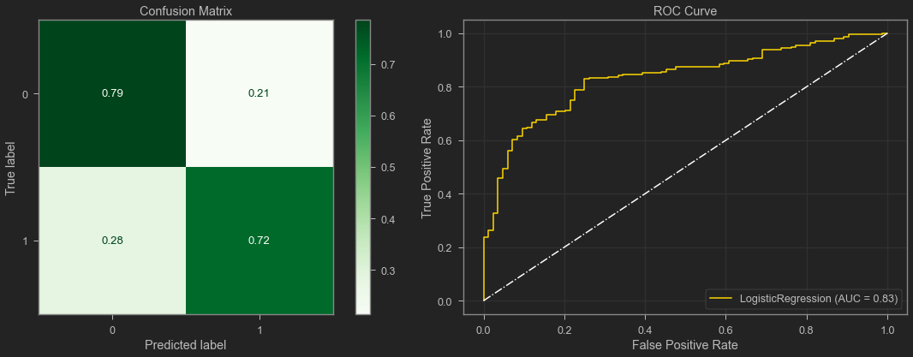
    


Overall good performance. Can detect majority of true negatives and positives, with good recall and and f1. ROC curve also looks good.


    
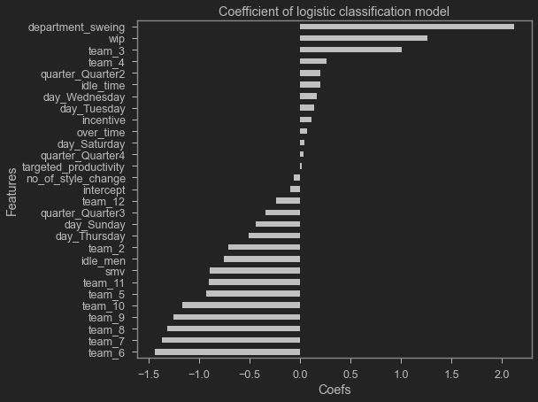
    


By looking at the coefs of the model, I can have a idea of feature importance and their impact on the prediction. `department_sweing` and `wip` has highest coef. and some teams are under performing, but teams of both department share number as identifier.  

### grid search with Cross Validation


```python
logreg_gs = LogisticRegression(max_iter=1e4,
                               class_weight='balanced',
                               n_jobs=-1)
params = {
    'C': [.1, 1, 10, 100, 10000, 1e6, 1e12],
    'tol': [0.0001, 0.001, 0.01, .1],
    'penalty': ['l1', 'l2', 'elasticnet', None],
    'solver': ['newton-cg', 'lbfgs', 'liblinear', 'sag', 'saga']
}
gridsearch_logreg = GridSearchCV(estimator=logreg_gs,
                                 param_grid=params,
                                 n_jobs=-1,
                                 scoring='precision')
```


```python

gridsearch_logreg.fit(X_train_log_reg, y_train)
print(f"Best Parameters by gridsearch:\t{gridsearch_logreg.best_params_}")
print(f"Best Estimator by gridsearch:\t{gridsearch_logreg.best_estimator_}")
```

    Best Parameters by gridsearch:	{'C': 0.1, 'penalty': 'l1', 'solver': 'saga', 'tol': 0.0001}
    Best Estimator by gridsearch:	LogisticRegression(C=0.1, class_weight='balanced', max_iter=10000.0, n_jobs=-1,
                       penalty='l1', solver='saga')
    


```python

logreg_gs_best = gridsearch_logreg.best_estimator_
fun.model_report(logreg_gs_best, X_train_log_reg, y_train, X_test_log_reg,
              y_test)
```


<strong>Report of LogisticRegression type model using train-test split dataset.</strong>


    ******************************************************************************************
    Train accuracy score: 0.728
    Test accuracy score: 0.7467
        No over or underfitting detected, diffrence of scores did not cross 5% thresh hold.
    ******************************************************************************************
    
    ************************************************************
    Classification report on test data of:
        LogisticRegression(C=0.1, class_weight='balanced', max_iter=10000.0, n_jobs=-1,
                       penalty='l1', solver='saga')
    ------------------------------------------------------------
                  precision    recall  f1-score   support
    
               0       0.53      0.80      0.64        84
               1       0.90      0.73      0.81       216
    
        accuracy                           0.75       300
       macro avg       0.72      0.76      0.72       300
    weighted avg       0.80      0.75      0.76       300
    
    ************************************************************
    


    

    


Very minimal improvement overall.

At this point I can tackle outliers by removing them based on Z-score or IQR or other method; and considering scaling options can be done here. But chance of data loss is higher. Moreover, disruption of distribution of data is required for this process. <br>Moving on to next type of model. 

## KNN Clustering


```python
X_train_knn, X_test_knn = fun.dataset_preprocessing_pipeline(X_train, X_test)

knn = KNeighborsClassifier()
fun.model_report(knn,
                 X_train_knn,
                 y_train,
                 X_test_knn,
                 y_test,
                 show_train_report=True)
```


<strong>Report of KNeighborsClassifier type model using train-test split dataset.</strong>


    ******************************************************************************************
    Train accuracy score: 0.8766
    Test accuracy score: 0.8633
        No over or underfitting detected, diffrence of scores did not cross 5% thresh hold.
    ******************************************************************************************
    
    ************************************************************
    Classification report on train data of:
            KNeighborsClassifier()
    ------------------------------------------------------------
                  precision    recall  f1-score   support
    
               0       0.86      0.90      0.88       875
               1       0.90      0.85      0.87       875
    
        accuracy                           0.88      1750
       macro avg       0.88      0.88      0.88      1750
    weighted avg       0.88      0.88      0.88      1750
    
    ************************************************************
    


    
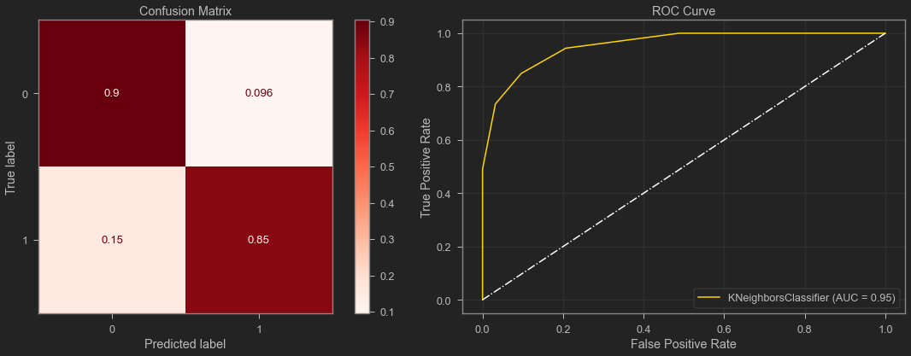
    


    ==========================================================================================================================================================================
    ************************************************************
    Classification report on test data of:
        KNeighborsClassifier()
    ------------------------------------------------------------
                  precision    recall  f1-score   support
    
               0       0.72      0.85      0.78        84
               1       0.94      0.87      0.90       216
    
        accuracy                           0.86       300
       macro avg       0.83      0.86      0.84       300
    weighted avg       0.87      0.86      0.87       300
    
    ************************************************************
    


    
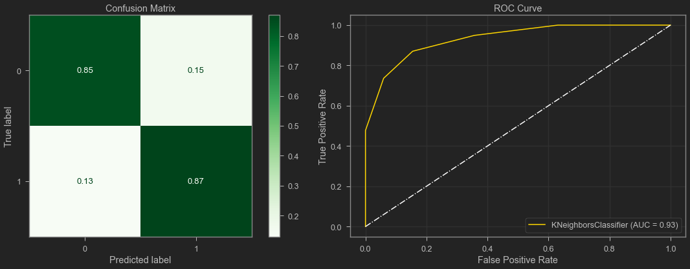
    


Way better performance than previous model. True negative and positives are better, all the metrics are looking good. ROC curve is improved. But this can be better better by some hyperparameter tuning.

### grid search with Cross Validation


```python
knn_gs = KNeighborsClassifier(n_jobs=-1)
params = {
    'n_neighbors': list(range(1, 31, 2)),
    'weights': ['uniform', 'distance'],
    'algorithm': ['auto', 'ball_tree', 'kd_tree', 'brute'],
    'p': [1, 2, 2.5, 3, 4],
    'leaf_size': [30, 40],
    #     'metric': ['minkowski', 'manhattan', 'euclidean']
}
gridsearch_knn = GridSearchCV(estimator=knn_gs,
                              param_grid=params,
                              n_jobs=-1,
                              scoring='precision',return_train_score=True)
```


```python
gridsearch_knn.fit(X_train_knn, y_train)
print(f"Best Parameters by gridsearch:\t{gridsearch_knn.best_params_}")
print(f"Best Estimator by gridsearch:\t{gridsearch_knn.best_estimator_}")

knn_gs_best = gridsearch_knn.best_estimator_
fun.model_report(knn_gs_best, X_train_knn, y_train, X_test_knn,
             y_test)
```

    Best Parameters by gridsearch:	{'algorithm': 'auto', 'leaf_size': 30, 'n_neighbors': 17, 'p': 1, 'weights': 'distance'}
    Best Estimator by gridsearch:	KNeighborsClassifier(n_jobs=-1, n_neighbors=17, p=1, weights='distance')
    


<strong>Report of KNeighborsClassifier type model using train-test split dataset.</strong>


    ******************************************************************************************
    Train accuracy score: 0.9994
    Test accuracy score: 1.0
        No over or underfitting detected, diffrence of scores did not cross 5% thresh hold.
    ******************************************************************************************
    
    ************************************************************
    Classification report on test data of:
        KNeighborsClassifier(n_jobs=-1, n_neighbors=17, p=1, weights='distance')
    ------------------------------------------------------------
                  precision    recall  f1-score   support
    
               0       1.00      1.00      1.00        84
               1       1.00      1.00      1.00       216
    
        accuracy                           1.00       300
       macro avg       1.00      1.00      1.00       300
    weighted avg       1.00      1.00      1.00       300
    
    ************************************************************
    


    

    


Perfect result. It can predict with certainty. It has all the scores perfect across all the metrics and ROC curve is perfect.


    {'algorithm': 'auto',
     'leaf_size': 30,
     'metric': 'minkowski',
     'metric_params': None,
     'n_jobs': -1,
     'n_neighbors': 17,
     'p': 1,
     'weights': 'distance'}


These are the best parameters.

## ensemble methods


```python
X_train_ensbl, X_test_ensbl = fun.dataset_preprocessing_pipeline(
    X_train, X_test)
```

### Random Forest™


<br>`Random Forest` is a trademark of Leo Breiman and Adele Cutler and is licensed exclusively to "Salford Systems", subsidiary of "Minitab, LLC", for the commercial release of the software. Random Forest A.K.A. random decision forests. This is one of the extensively used black-box models. KKN and RF can be both classified as <i>weighted neighborhoods schemes</i>. I am using scikit-learn's implementation of the concept.


<br>RF generally requires less tuning for acceptable performance. Thus I am using random decision forest here, as I got a good result using KNN after some hyperparameter tuning via grid search with cross validation.


```python
rf_clf = RandomForestClassifier()
```


```python
fun.model_report(rf_clf, X_train_ensbl, y_train, X_test_ensbl,
             y_test)
```


<strong>Report of RandomForestClassifier type model using train-test split dataset.</strong>


    ******************************************************************************************
    Train accuracy score: 0.9994
    Test accuracy score: 0.9967
        No over or underfitting detected, diffrence of scores did not cross 5% thresh hold.
    ******************************************************************************************
    
    ************************************************************
    Classification report on test data of:
        RandomForestClassifier()
    ------------------------------------------------------------
                  precision    recall  f1-score   support
    
               0       0.99      1.00      0.99        79
               1       1.00      1.00      1.00       221
    
        accuracy                           1.00       300
       macro avg       0.99      1.00      1.00       300
    weighted avg       1.00      1.00      1.00       300
    
    ************************************************************
    


    
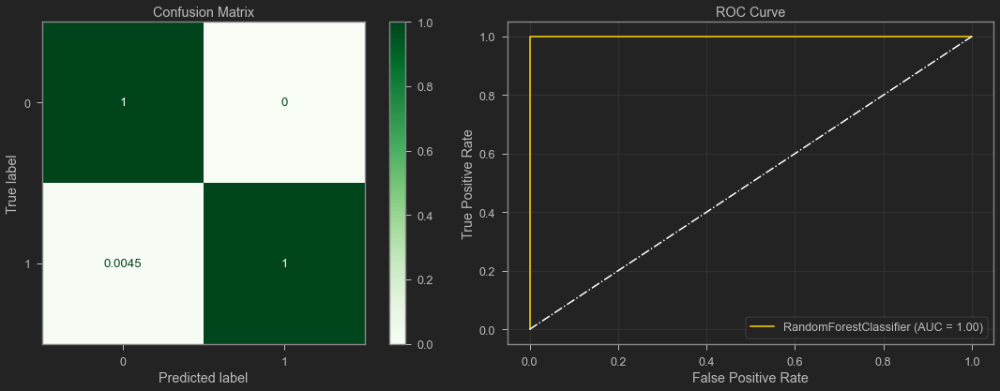
    


As expected I have the same level of performance with the out-of-the-box model without any tuning. Lets look at the first few nods of the tree of the 10th tree. I choose 10th at random. This output is not friendly to see in a notebook. A copy of this can be found at `'./saved_model/rf_clf_sample_4.pdf'` in side this repository as a pdf file.


    Parameter used for the model:
    {'bootstrap': True, 'ccp_alpha': 0.0, 'class_weight': None, 'criterion': 'gini', 'max_depth': None, 'max_features': 'auto', 'max_leaf_nodes': None, 'max_samples': None, 'min_impurity_decrease': 0.0, 'min_impurity_split': None, 'min_samples_leaf': 1, 'min_samples_split': 2, 'min_weight_fraction_leaf': 0.0, 'n_estimators': 100, 'n_jobs': None, 'oob_score': False, 'random_state': None, 'verbose': 0, 'warm_start': False}
    


    
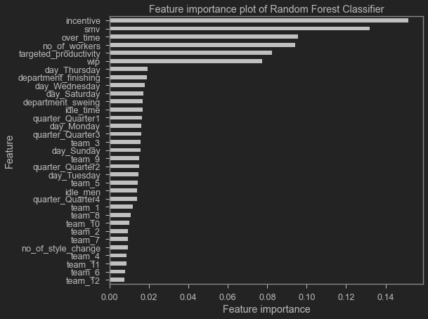
    


Most important features are, in descending order, `incentive`, `smv`, `overtime`, `no_of_workers`, `targeted_productivity` and so on. 
This means those features were often used for building the forests. And those features make real life sense also.

## Selecting Best model

Random Forest model is the best one, this can achieve perfect prediction with minimal effort. 
<br>This is `rf_clf` model object in this notebook.

# INTERPRET


    
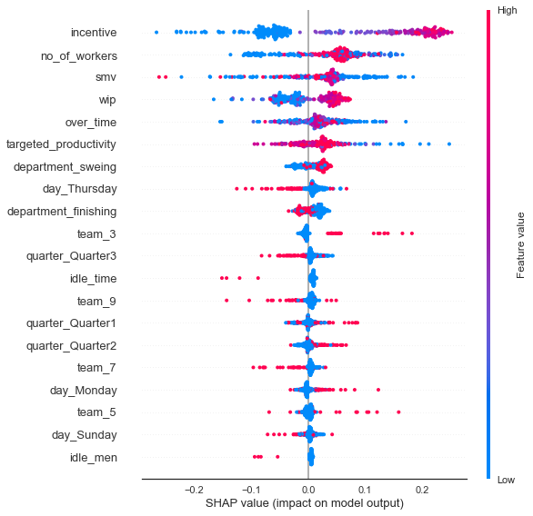
    


This plot is showing contribution of each feature on a machine learning model prediction. This graph is for detecting goal met class.
- Few explanations:
<br>

    | Features | Probability of goal met | Probability of goal not met |
    |-|-|-|
    | department_finishing | Lower Value | Higher Value |
    | department_sweing | High Value | Lower Value |
    | idle_men | Lower Value |  |
    | idle_time | Lower Value |  |
    | incentive | High Value | Lower Value |
    | no_of_workers | Above Average | Below Average And High |
    | over_time | Average | Below Average And High |
    | smv | Above Average | Below Average And High |
    | targeted_productivity | Lower Value | Higher Value |
    | wip | High Value | Lower Value |


# RECOMMENDATION & CONCLUSION

This model can be used with confidence for predicting employee performance. It can detect both True negatives and positives with high precision.

- Few insights where to focus
    - `incentive` is very important decider for performance.
    - tune optimal `no_of_workers` for better performance.
    

# NEXT STEPS

- do a multi-class prediction by further binning of target.
- fit a model with entire data and prepare for production use.
- fine-tune functions for general use and add options for users.
- mend appendix contents

